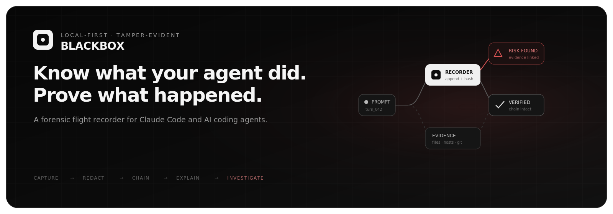
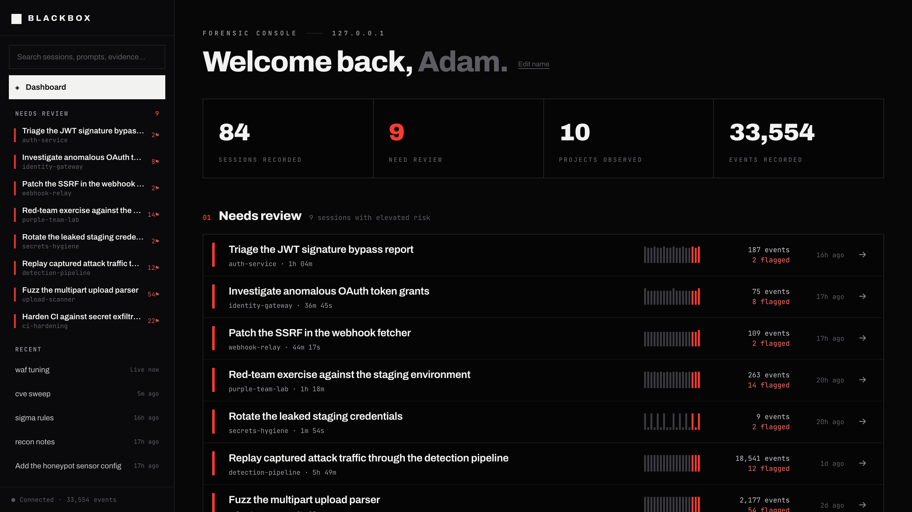
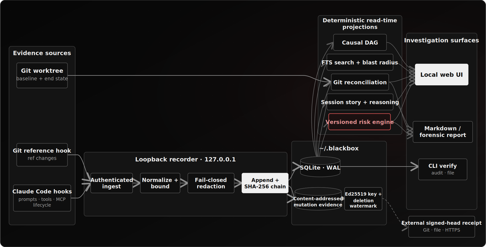

<div align="center">



# Blackbox

**A local-first forensic flight recorder for AI coding agents.**

Capture Claude Code activity, explain risk in plain language, trace every finding back to evidence, and verify that the record was not silently rewritten.

[](LICENSE)
[](package.json)
[](CHANGELOG.md)
[](#privacy-and-data-lifecycle)

[Quick start](#quick-start) · [How it works](#how-it-works) · [Security model](#security-model) · [Contributing](CONTRIBUTING.md)

</div>

---

When an AI coding agent changes authentication, reads a credential file, runs a destructive command, or sends data to an external host, ordinary chat history is not enough. You need to know **what happened, what it touched, why it matters, and whether the evidence is still trustworthy**.

Blackbox sits beside the agent as a passive recorder. It turns hook-visible actions into a redacted, hash-chained event record; corroborates file changes against Git; evaluates deterministic risk rules; and presents the result as a calm investigation workflow instead of a wall of logs.

> [!IMPORTANT]
> Blackbox `0.1.x` is a **macOS-first public beta**. It records and explains; it does not block, sandbox, roll back, or claim kernel-level visibility.

<p align="center">
  
  <br />
  <sub>Real interface · fully synthetic demo data · no captured user sessions</sub>
</p>

## Why Blackbox?

| Ordinary agent logs | Blackbox |
| --- | --- |
| Optimized for replaying a conversation | Optimized for investigating an incident |
| Mutable files with unclear completeness | Append-only SHA-256 chain with signed checkpoints |
| Commands without causal context | Prompts → reasoning → tools → files → findings |
| Raw output can contain secrets | Capture-time redaction; output bodies elided by default |
| “Something changed” | Git-corroborated ghost, phantom, and content-mismatch findings |
| Risk buried in thousands of events | Deterministic findings, blast radius, and containment actions |
| Trust the local database | Verify locally and witness signed heads off-machine |

### Built for answers, not more telemetry

- **What did the agent do?** A readable prompt-by-prompt activity timeline.
- **What was affected?** Changed files, sensitive paths, Git artifacts, and observed outbound targets.
- **Why is this risky?** Versioned rules with evidence-linked, plain-language explanations.
- **Can I trust the record?** Hash-chain verification, Ed25519 checkpoints, a deletion watermark, and external receipts.
- **What should I do next?** Severity-ordered containment guidance and a shareable forensic report.

## Quick start

### Prerequisites

- macOS for the complete lifecycle and LaunchAgent support
- [Claude Code](https://docs.anthropic.com/en/docs/claude-code) `2.1.119` or newer
- Node.js **18, 20, or 22** — the native SQLite dependency is not supported on Node 23+
- Git

### 1. Install from source

```bash
git clone https://github.com/adamhjouj/blackbox.git
cd blackbox
npm ci
npm run build
npm link
```

`npm link` makes the `blackbox` command available globally while keeping this beta easy to update from source.

### 2. Initialize Blackbox from the project you want to record

```bash
cd ~/code/your-project
blackbox init
```

This one command:

1. shows exactly what Blackbox captures and what can leave the machine;
2. adds asynchronous Blackbox handlers to `~/.claude/settings.json` without replacing your existing hooks;
3. creates a local signing key and authenticated Git-collector token;
4. configures signed head receipts on `refs/blackbox/anchors` using the current repository's remote;
5. starts the loopback-only recorder on `127.0.0.1:7842`.

If the repository has no remote, Blackbox refuses to silently downgrade custody. For an intentionally local-only setup:

```bash
blackbox init --local-only-anchor
```

That mode is fully usable, but a process with write access to all of `~/.blackbox` could rewrite the database, key, watermark, and local receipts together.

### 3. Use Claude Code normally

```bash
claude
```

Prompts, agent-stated reasoning, tool calls, MCP activity, file mutations, Git facts, duration, model, and token usage are recorded automatically when the corresponding source exposes them.

### 4. Open the investigation UI

```bash
blackbox ui
```

Open a session from the dashboard, understand its outcome and risk on **Overview**, follow each prompt on **Activity**, inspect raw support on **Evidence**, or re-root the deterministic causal **Graph** around a finding.

### 5. Confirm the installation

```bash
blackbox doctor
blackbox verify --anchors
```

`doctor` checks the runtime, Claude Code, hooks, daemon, state directory, collector authentication, custody posture, event store, and chain integrity.

## Try it without recording a real session

```bash
npm run demo
```

The demo builds an isolated store under `.blackbox-demo/`, ingests two fully synthetic sessions, starts a recorder on port `7843`, and opens the UI. It never reads or modifies `~/.blackbox`.

## How it works

<p align="center">
  
</p>

Blackbox keeps the full record on your machine. At session boundaries, it can also write a tiny signed receipt to Git, a file, or HTTPS. That receipt contains a version, sequence, head hash, signature, public-key fingerprint, and timestamp—**never** a prompt, source code, path, command, tool output, or secret.

## Investigation model

### Dashboard

Search sessions, projects, prompts, and evidence from one place. Recent-session cards surface project, time, event count, severity, and flagged actions without a permanent sidebar. Routes are restorable and browser Back/Forward works.

### Overview

A deterministic summary answers what changed, the primary findings, integrity state, affected files/hosts, and the next containment actions above the fold. Blackbox does not invent AI-generated incident claims.

### Activity

Each turn retains its prompt identity and shows duration, model, token usage, tools, nested steps, outcomes, and the agent's **stated reasoning** when available. Selecting a step opens evidence without losing scroll or expansion state.

### Evidence

Inspect blast radius, redactions, outbound targets observed in commands/tool inputs, changed files, reconciliation, chain verification, raw redacted dossiers, and mutation history. Stored bodies can be aged out while their cryptographic commitments remain.

### Graph

The graph is a deterministic Sugiyama-style DAG, not an AI visualization. Re-root it around a finding, prompt, or evidence item to see the smallest useful causal neighborhood; expand directories and depth only when needed.

## What Blackbox records

| Signal | Examples | Storage behavior |
| --- | --- | --- |
| Session lifecycle | start, stop, end, compaction, notifications | Hash-chained event |
| User intent | prompt text and prompt identifiers | Redacted, bounded, hash-chained |
| Agent-stated intent | available reasoning summary, model, token usage | Redacted and attached to its turn |
| Tool activity | shell, files, web fetches, tasks, MCP calls | Inputs retained after redaction; outputs hashed by default |
| File mutations | redacted patches/bodies, hashes, diffstat | Content-addressed and independently prunable |
| Git ground truth | refs, commits, worktree baseline/end state | Used for reconciliation |
| Environment | toolchain versions, MCP names, manifest hashes | Arguments and environment secrets excluded |
| Risk interpretation | flags, combinations, evidence links | Re-derivable under a versioned ruleset |

Blackbox only knows what its configured sources expose. “Outbound host” means a target observed in a hook-visible command or tool input—not proof from a kernel network sensor.

## Risk and reconciliation

The current `r4` ruleset detects and composes evidence for:

- sensitive-file reads followed by external sends;
- prompt-injection markers followed by auth weakening, execution, exfiltration, or CI changes;
- newly configured MCP servers handling previously read sensitive files;
- destructive shell and Git operations;
- changes that weaken TLS, signature checks, authorization, CORS, CSRF, SSH host keys, or authentication guards;
- attempts to stop the recorder, rewrite its store/key, disable hooks, or redirect its home.

Risk is an interpretation layer, never part of the immutable chain. You can recompute it without changing recorded evidence:

```bash
blackbox rescore --ruleset r4
blackbox rescore --ruleset r4 --check
```

At session end, reconciliation compares hook-reported mutations with Git's observed worktree:

- **Ghost mutation** — Git sees a change with no matching file hook.
- **Phantom mutation** — a hook reports a change absent from the end state.
- **Content mismatch** — a stored write body disagrees with the on-disk digest.

These are discrepancy facts, not automatic accusations of agent behavior.

## Everyday commands

| Command | Purpose |
| --- | --- |
| `blackbox status` | Recorder state, event count, authentication, and anchor posture |
| `blackbox doctor` | Diagnose the full installation and verify the chain |
| `blackbox ui` | Open the local investigation interface |
| `blackbox sessions` | List recorded sessions |
| `blackbox search "query"` | Search prompts and redacted evidence |
| `blackbox blast --session <id>` | Summarize affected files, targets, Git artifacts, and containment |
| `blackbox file <path> --session <id>` | Inspect mutation history and stored evidence |
| `blackbox verify --anchors` | Verify hashes, signatures, watermark, and configured receipts |
| `blackbox audit --session <id>` | Show what was redacted without revealing the secret |
| `blackbox report --session <id>` | Export a deterministic Markdown review |
| `blackbox report --session <id> --forensic` | Export custody, verification, findings, and a self-manifest |
| `blackbox help --all` | Show every command and option |

## Security model

### What Blackbox is designed to protect

- **Secret exposure at rest:** known secret shapes are redacted before the first event write. If redaction throws, content is dropped to a hash.
- **Silent row editing:** each event hashes all normalized columns and the preceding event hash.
- **Tail deletion:** an atomically updated head record preserves expected sequence and count.
- **Consistent local rewrites:** Ed25519 checkpoints are verified against a trusted local public key.
- **Signature deletion:** a high-watermark outside the database requires the latest expected checkpoint to remain.
- **Full local-state rewrites:** external signed-head receipts let an independent destination prove the old chain existed.
- **Hostile recorded content:** the UI uses text-only DOM construction, a restrictive CSP, same-origin reads, and a loopback-only server.

### Honest limits

- A process controlling the database, signing key, watermark, configuration, hooks, **and every external receipt** can defeat custody.
- Redaction is defense in depth, not a mathematical guarantee that every future secret format is recognized.
- Hook capture can be incomplete; Blackbox records daemon downtime and reconciles transcript coverage so gaps are visible.
- Git corroborates file state, not process or network activity.
- The recorder is observational. It does not prevent execution, enforce policy, isolate agents, or restore files.
- Agent “reasoning” is the agent-supplied explanation available to the transcript—not private hidden chain-of-thought.

Read [SECURITY.md](SECURITY.md), [docs/ARCHITECTURE.md](docs/ARCHITECTURE.md), and [docs/FORENSIC-COLLECTORS.md](docs/FORENSIC-COLLECTORS.md) before relying on Blackbox for an incident-response process.

## Privacy and data lifecycle

By default, local state lives in `~/.blackbox`:

```text
~/.blackbox/
├── blackbox.db       # events, derived layers, and mutation evidence
├── config.json       # port, collector token, and anchor configuration
├── signing.key       # Ed25519 private key, mode 0600
├── signing.pub       # trusted public key
├── signing.head      # checkpoint high-watermark
├── daemon.pid
└── daemon.log
```

Override the location for testing or isolation with `BLACKBOX_HOME`, `BLACKBOX_DB`, or `--db`.

Open **Edit name → Recorder & privacy** in the dashboard (or visit `#/settings`) for a readable local view of the recorder endpoint, database location and size, retention behavior, output-body storage, custody destination, and removal commands. The posture endpoint is same-origin and never exposes the collector token.

### Retain facts, age out stored content

```bash
blackbox prune --older-than 30d
```

Pruning removes old redacted mutation bodies while retaining event facts, hashes, sizes, diffstats, tombstones, and chain verification. Because sessions share one append-only custody chain, Blackbox does not pretend that deleting one session is a harmless operation.

### Erase all local Blackbox data

```bash
blackbox erase --all --yes
```

This stops the daemon and permanently removes the event store, signing keys, logs, and local receipts. Claude hooks remain installed.

### Complete uninstall, including data

```bash
blackbox uninit --erase-data --yes
```

This removes only Blackbox handlers from Claude settings, preserves unrelated hooks, stops the daemon, disables its macOS LaunchAgent, and removes `~/.blackbox`. Receipts already pushed to a Git remote or written to another destination must be removed according to that destination's retention policy.

## Configuration and platform support

| Capability | macOS | Linux | Windows |
| --- | :---: | :---: | :---: |
| Recorder, UI, reports, verification | ✅ | ✅ | Experimental |
| Claude Code HTTP hooks | ✅ | ✅ | Experimental |
| Git reference hooks | ✅ | ✅ | Experimental |
| Managed autostart | LaunchAgent | Manual | Manual |
| CI coverage | Node 18/20/22 | Node 18/20/22 | Not yet |

The daemon binds only to `127.0.0.1`. The `/git` collector route requires the generated token unless you explicitly start with the insecure development escape hatch `--allow-insecure-git`.

## Repository map

```text
src/
├── daemon.ts                    loopback receiver, read API, and UI serving
├── store.ts · hash.ts           append-only SQLite chain
├── normalize.ts · redact.ts     tolerant normalization and fail-closed redaction
├── risk-engine.ts · rules*.ts   versioned deterministic interpretation
├── mutation.ts · filestate.ts   content-addressed evidence and reconstruction
├── git-collector.ts             ref-change facts
├── worktree.ts · reconcile.ts   Git ground-truth comparison
├── transcript.ts                prompt and agent-stated reasoning recovery
├── provenance.ts · graph.ts     story and deterministic causal DAG
├── sign.ts · anchor.ts          checkpoints, watermark, external receipts
├── search.ts · blast.ts         corpus search and containment projection
├── report.ts                    review and forensic case-file exports
├── doctor.ts                    installation and health diagnostics
└── ui/                          dependency-free dashboard and investigation views

test/                            security, invariants, integration, and UI tests
examples/demo-events.jsonl       fully synthetic demo capture
docs/                            architecture, collectors, and phase decisions
experiments/                     reproducible hook/collector research
```

The runtime remains TypeScript plus vanilla browser JavaScript. The served UI is self-contained and has no frontend framework or runtime dependency.

## Development

```bash
git clone https://github.com/adamhjouj/blackbox.git
cd blackbox
npm ci
npm test
npm run demo
```

CI builds and tests Node 18, 20, and 22 on macOS and Linux. Tagged releases run the same suite, build an npm-compatible `.tgz`, generate `SHA256SUMS.txt`, and attach both to the GitHub release.

Before opening a pull request, read [CONTRIBUTING.md](CONTRIBUTING.md). The key invariants are simple but strict: redact before persistence, preserve append-only evidence, keep projections deterministic, render recorded data as hostile text, and document limitations without marketing around them.

## FAQ

<details>
<summary><strong>Does Blackbox send my code or prompts anywhere?</strong></summary>

No. Events, prompts, paths, code, and evidence remain in the local database. If external anchoring is enabled, only tiny signed chain-head receipts leave the machine.

</details>

<details>
<summary><strong>Does it slow Claude Code down?</strong></summary>

Blackbox installs asynchronous HTTP hooks so recording is kept off the agent's critical path. Extremely busy systems can still experience resource contention; coverage diagnostics make capture gaps visible rather than hiding them.

</details>

<details>
<summary><strong>Is Blackbox an EDR, sandbox, or policy engine?</strong></summary>

No. It is a recorder and investigation tool. It does not provide kernel telemetry, execution prevention, isolation, rollback, or policy enforcement.

</details>

<details>
<summary><strong>Why require an external anchor by default?</strong></summary>

A hash chain stored beside its signing key can prove accidental corruption and limited tampering, but a full-write attacker can rewrite both. A signed head witnessed elsewhere makes that rewrite provable. Local-only mode remains available as an explicit tradeoff.

</details>

<details>
<summary><strong>Can I use it with agents other than Claude Code?</strong></summary>

The normalized store and read APIs are agent-agnostic, but the complete capture adapter currently targets Claude Code hooks first. New collectors must preserve the same redaction and provenance invariants.

</details>

## Contributing and community

Issues, false-positive fixtures, accessibility improvements, Linux packaging work, and new evidence adapters are welcome. Please use synthetic data in public discussions and report vulnerabilities privately.

- [Contribution guide](CONTRIBUTING.md)
- [Security policy](SECURITY.md)
- [Code of conduct](CODE_OF_CONDUCT.md)
- [Changelog](CHANGELOG.md)

## License

Blackbox is released under the [MIT License](LICENSE).

<div align="center">

**Record locally. Investigate clearly. Verify independently.**

If Blackbox helps you understand an agent incident, consider starring the repository and sharing a synthetic reproduction that makes the next investigation easier.

</div>
