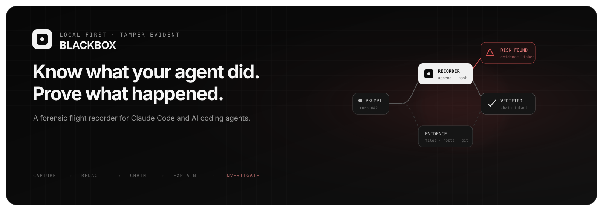
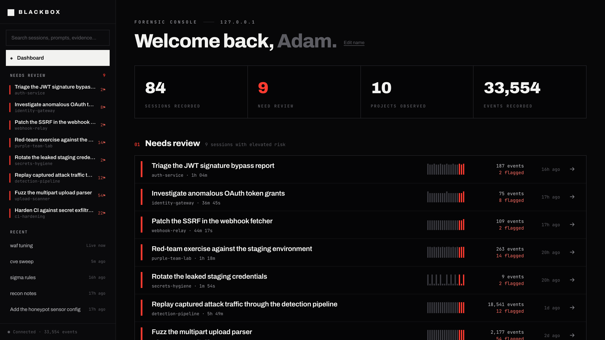
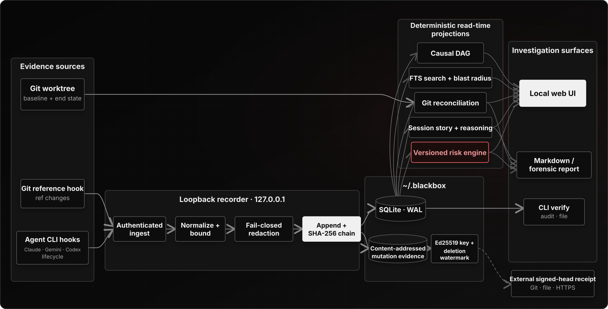

<div align="center">



# Blackbox

**A local-first forensic flight recorder and pre-merge review inbox for AI coding agents.**

Record Claude Code, Gemini CLI, and Codex CLI activity, explain deterministic risk, acknowledge findings before merge, and export a signed summary without uploading the raw evidence.

[](LICENSE)
[](package.json)
[](CHANGELOG.md)
[](#privacy-and-egress)

[Quick start](#quick-start) · [Review before merge](#review-before-merge) · [Attestations](#signed-session-attestations) · [Security model](#security-model)

</div>

---

When an AI coding agent changes authentication, reads a credential file, runs a destructive command, or targets an external host, chat history is not enough. You need to know what happened, what evidence supports the conclusion, whether the action succeeded, and whether the record was rewritten later.

Blackbox sits beside the agent as a passive recorder. Supported hooks are normalized into one redacted, hash-chained event schema. Deterministic rules and Git reconciliation turn that evidence into reviewable findings, while signed attestations let CI consume aggregate session state without receiving prompts, commands, paths, code, tool output, or review notes.

> [!IMPORTANT]
> Blackbox `0.1.x` is a macOS-first public beta. The recorder, UI, reports, and verification also run on Linux; managed autostart is currently macOS-only. Blackbox observes and explains. It does not block execution, sandbox an agent, enforce policy, roll back files, or provide kernel-level process/network telemetry.

<p align="center">
  
  <br />
  <sub>Real interface · fully synthetic demo data · no captured user sessions</sub>
</p>

## Why Blackbox?

| Ordinary agent logs | Blackbox |
| --- | --- |
| Conversation replay | Investigation-oriented sessions and evidence links |
| Mutable files with unclear completeness | Append-only SHA-256 chain, local Ed25519 checkpoints, and optional external receipts |
| A risky command shown without its result | Explicit attempted, succeeded, failed, or unknown outcomes |
| Thousands of events to scan manually | Deterministic findings and a pre-merge Review Inbox |
| Repeated expected behavior becomes alert fatigue | Strict project baselines that label findings without hiding them |
| Raw output may contain secrets | Capture-time redaction; output bodies are elided to hashes by default |
| CI needs the whole log to make a decision | Signed aggregate session attestations and optional GitHub Actions output |

## Quick start

### Prerequisites

- Node.js `22`, `24`, or `26`
- [Claude Code](https://docs.anthropic.com/en/docs/claude-code), [Gemini CLI](https://github.com/google-gemini/gemini-cli), and/or [Codex CLI](https://learn.chatgpt.com/docs/developer-commands?surface=cli)
- Git, recommended for revision metadata, worktree reconciliation, and Git-based external receipts
- macOS for managed LaunchAgent autostart; Linux lifecycle commands are supported without managed autostart

Claude Code `2.1.119` or newer provides the richest timing fields. Older `2.1.x` builds can still record, but `blackbox init` warns when known fields may be absent.

### 1. Install and initialize in one command

Run this from the repository you want Blackbox to associate with setup:

```bash
npx --yes blackbox-recorder@beta install
```

The bootstrap installs the exact Blackbox version it is running into a durable npm global location, then launches first-run setup from that durable copy. This matters for Gemini and Codex command hooks and autostart entries, which must not point into a disposable `npx` cache.

The command requires a published npm `beta` dist-tag. An unpublished source checkout does not create or update that tag; use the source workflow below when testing local changes.

First-run setup:

1. prints what will be recorded and where it will be stored;
2. asks before enabling an external Git receipt destination;
3. creates private configuration and Ed25519 signing material;
4. starts the loopback recorder and runs an isolated capture/redaction/signing self-test;
5. merges Blackbox handlers into the selected agent settings without replacing unrelated hooks;
6. opens the Health & Privacy screen at `http://127.0.0.1:7842/#/settings`.

By default, setup detects installed agents. Select adapters explicitly when needed:

```bash
blackbox init --agents claude
blackbox init --agents gemini
blackbox init --agents codex
blackbox init --agents claude,gemini,codex
```

If the current Git repository has no usable remote, setup refuses to silently weaken custody. Choose local-only receipts explicitly:

```bash
blackbox init --local-only-anchor
```

Local-only mode records normally, but a process able to rewrite all of `~/.blackbox` could replace the database, signing key, watermark, and local receipts together.

<details>
<summary><strong>Install from source instead</strong></summary>

```bash
git clone https://github.com/adamhjouj/blackbox.git
cd blackbox
npm ci
npm run build
npm link
blackbox init
```

Run `npm ci` again after changing Node major versions because Blackbox includes a native SQLite dependency.

</details>

### 2. Use your agent normally

```bash
claude
# or
gemini
# or
codex
```

Blackbox records the events each adapter exposes. All three adapters feed the same normalized event schema, risk engine, evidence chain, Review Inbox, reports, and attestation format. Adapter coverage is not identical: a missing source field degrades to `null`, an unknown outcome, or an unmatched correlation state rather than being invented.

After first configuring Codex, open `/hooks` in Codex CLI and review/trust the Blackbox command hooks. Codex binds trust to the exact hook definition and skips new or changed non-managed hooks until they are trusted.

### 3. Confirm recorder health

```bash
blackbox status
blackbox doctor
blackbox self-test
blackbox verify --anchors
```

`doctor` checks the Node runtime, state-directory permissions, signing identity, configured Claude/Gemini/Codex hooks, daemon health, collector authentication, custody posture, event store, and chain integrity. `self-test` uses an isolated temporary store and never appends to the real evidence chain.

### 4. Open the investigation UI

```bash
blackbox ui
```

The local UI includes first-run readiness, session investigation, the Review Inbox, and direct Settings navigation. Its routes are restorable; Settings is available directly at `#/settings` and Review Inbox at `#/review`.

## Try it without recording a real session

```bash
npm run demo
```

The demo builds an isolated store under `.blackbox-demo/`, ingests fully synthetic sessions, and serves the UI on port `7843`. It does not read or modify `~/.blackbox`.

## How it works

<p align="center">
  
</p>

### Capture adapters

- **Claude Code:** asynchronous HTTP hooks post lifecycle, prompt, tool, compaction, notification, and stop events to `127.0.0.1:7842/hook`.
- **Gemini CLI:** command hooks bridge lifecycle, agent, tool, notification, compression, and session-end events to `127.0.0.1:7842/hook/gemini`. The bridge always returns Gemini's allow response; recorder failure does not block the agent.
- **Codex CLI:** trusted command hooks bridge session, prompt, tool, approval, compaction, subagent, stop, and session-end events to `127.0.0.1:7842/hook/codex`. Stable Codex session, turn, and tool-use ids are retained. Explicit result signals become succeeded/failed outcomes; opaque result shapes remain unknown.
- **Git collector:** optional repository hooks submit authenticated ref-change facts to `/git`, while session boundaries capture worktree state for reconciliation.

Inputs are normalized tolerantly, redacted before persistence, and appended to one SQLite chain. New rows identify their source as `claude-code`, `gemini-cli`, `codex-cli`, `git`, or `blackbox`; legacy rows keep a `null` source so their existing hashes remain valid.

### Outcome-aware findings

Pre-tool events describe intent. A matching post event proves tool-reported success; a failure event proves tool-reported failure; missing or unmatched evidence remains attempted or unknown. The current `r4` ruleset uses those outcomes consistently across findings, the UI, graph, reports, blast radius, and OTLP export.

A failed exfiltration attempt can remain a high-severity finding because intent and sensitive-data flow still matter, but Blackbox labels it failed and never describes the data as sent or confirmed.

### Risk and reconciliation

The deterministic `r4` ruleset detects and composes evidence for:

- sensitive-file reads followed by observed external-send attempts;
- prompt-injection markers followed by auth weakening, execution, external sends, or CI changes;
- newly configured MCP servers handling previously read sensitive files;
- destructive shell and Git operations;
- changes that weaken TLS, signature checks, authorization, CORS, CSRF, SSH host keys, or authentication guards;
- attempts to stop the recorder, rewrite its store/key, disable hooks, or redirect its home.

Risk is a derived interpretation layer, not part of the immutable event bytes:

```bash
blackbox rescore --ruleset r4
blackbox rescore --ruleset r4 --check
```

At session end, reconciliation compares hook-reported mutations with Git-observed worktree state:

- **Ghost mutation:** Git sees a change with no matching file hook.
- **Phantom mutation:** a hook reports a change absent from the end state.
- **Content mismatch:** a stored write commitment disagrees with the observed file digest.

These are discrepancy facts, not automatic claims about intent or attribution.

## Review before merge

Open `blackbox ui`, then choose **Review Inbox**. It groups current unresolved findings by project, branch, commit, and session. Each finding shows severity, outcome, evidence-linked context, and any baseline match. A reviewer can record one of four local dispositions:

- `acknowledged`
- `expected`
- `false_positive`
- `unreviewed` (reopen)

Review actions are append-only rows outside the evidence chain. Every decision binds to the current session head and baseline-policy hash. New session evidence or a policy change makes the old decision stale and reopens the finding automatically.

### Project baselines

A repository can label known behavior with `.blackbox/policy.json`. Baselines are strict, versioned JSON and may match normalized finding ids, rule ids, hosts, paths, command prefixes, or MCP server names.

Baselines never remove evidence, findings, severity, or Review Inbox entries. They add an **Expected by baseline** label and reason. Invalid, oversized, or symlinked policies fail closed: the UI shows the error, existing decisions become stale, new review decisions are refused, and attestation generation stops until the policy is fixed.

See [docs/BASELINES.md](docs/BASELINES.md) for the schema and matching rules.

## Signed session attestations

Export a portable, Ed25519-signed summary for one recorded session:

```bash
blackbox attest --session <id> --out blackbox-attestation.json
blackbox attest verify blackbox-attestation.json
blackbox attest verify blackbox-attestation.json --check
```

The closed v1 payload includes the evidence range/head hash, optional revision (preferring the last captured session anchor), recorder fingerprint, agent sources, current `r4` verdict, aggregate finding severities/outcomes, aggregate review state, and available reconciliation coverage. It excludes prompts, commands, paths, hosts, working directories, session names, raw event bodies, mutation blobs, tool output, and review notes.

Standalone verification checks the strict schema and embedded Ed25519 signature. `--check` additionally pins the artifact to this recorder's local public key and verifies that its session range still matches the local chain. A self-contained signature proves integrity under the embedded key, not who owns that key; Blackbox refuses `--fail-on` or `--github-output` during verification unless identity is pinned with `--trusted-key` or `--check`.

### Optional GitHub Actions output

Inside GitHub Actions, Blackbox can append a metadata-only job summary and named step outputs. A severity threshold also controls the process exit code, so the Actions job becomes the repository's pass/fail check without a direct Checks API call:

```bash
blackbox attest \
  --session "$BLACKBOX_SESSION_ID" \
  --out blackbox-attestation.json \
  --github-output \
  --expected-commit "$BLACKBOX_EXPECTED_COMMIT" \
  --fail-on medium
```

GitHub output requires an attestation file and a full expected revision. In a `pull_request` workflow, set `BLACKBOX_EXPECTED_COMMIT` from `${{ github.event.pull_request.head.sha }}`; GitHub's default `GITHUB_SHA` identifies the synthetic merge commit for that event. For a `push` workflow, `GITHUB_SHA` is the appropriate value and is also Blackbox's default. A missing or different signed commit refuses output instead of checking an unrelated session. `--fail-on high` fails for unresolved high findings; `medium` includes high and medium; `low` includes all unresolved severities. Without a threshold, `blackbox_result` is `informational`, not `pass`. The command does not upload the attestation file. Upload it only if that is part of your workflow and retention policy.

See [docs/ATTESTATIONS.md](docs/ATTESTATIONS.md) for payload, verification, privacy, and CI details.

## Everyday commands

| Command | Purpose |
| --- | --- |
| `blackbox status` | Recorder state, event count, adapter/authentication status, and custody posture |
| `blackbox doctor` | Diagnose setup, permissions, hooks, daemon, signing, custody, and chain health |
| `blackbox self-test` | Exercise the pipeline using isolated synthetic evidence |
| `blackbox ui` | Open the local dashboard, Review Inbox, and Settings |
| `blackbox sessions` | List recorded sessions |
| `blackbox search "query"` | Search prompts and redacted evidence |
| `blackbox blast --session <id>` | Summarize affected files, observed targets, Git artifacts, and containment |
| `blackbox file <path> --session <id>` | Inspect mutation history and retained evidence |
| `blackbox verify --anchors` | Verify hashes, signatures, watermark, and configured receipts |
| `blackbox audit --session <id>` | Show what was redacted without revealing the secret |
| `blackbox report --session <id>` | Export a deterministic Markdown review |
| `blackbox report --session <id> --forensic` | Export custody, verification, findings, and a self-manifest |
| `blackbox attest --session <id> --out <file>` | Export a signed aggregate session attestation |
| `blackbox help --all` | Show every command and option |

## Security model

### What Blackbox is designed to detect or limit

- **Secret exposure at rest:** known secret shapes are redacted before the first event write. If redaction throws, content is dropped to a hash.
- **Silent event editing:** each event hashes its normalized columns and the preceding event hash.
- **Tail deletion:** an atomically updated chain head stores the expected sequence and count.
- **Checkpoint alteration/deletion:** Ed25519 checkpoints and an out-of-database high-watermark make several local rewrite and rollback classes detectable.
- **Full local-state rewrites:** an optional receipt witnessed somewhere the attacker cannot rewrite can prove an older chain head existed.
- **Hostile recorded content:** the UI uses text-only DOM construction, a restrictive content-security policy, same-origin APIs, Host checks, and a loopback-only server.
- **Stale review approvals:** review decisions bind to both the evidence head and normalized policy hash.

### Honest limits

- A process controlling the database, signing key, watermark, configuration, hooks, and every external receipt can defeat local custody.
- Redaction is defense in depth, not a guarantee that every future credential format will be recognized.
- Hook capture can be incomplete. Blackbox records daemon downtime and exposes reconciliation/coverage data where available, but a dropped hook never entered the chain.
- Git corroborates file and ref state, not process or network activity.
- An outbound host is a target observed in hook-visible arguments, not proof from a kernel network sensor.
- Tool success/failure is the agent platform's reported outcome. Blackbox does not independently prove remote delivery.
- Baselines and acknowledgements are reviewer context, not evidence deletion or enforcement.
- Attestations are aggregate snapshots. They do not contain enough evidence to reproduce the underlying findings.

Read [SECURITY.md](SECURITY.md) and [docs/ARCHITECTURE.md](docs/ARCHITECTURE.md) before using Blackbox as part of an incident-response or merge-gating process.

## Privacy and egress

Raw and redacted evidence stays local by default. Default state lives under `~/.blackbox`:

```text
~/.blackbox/
├── blackbox.db       # event chain, derived projections, review ledger, mutation evidence
├── config.json       # port, collector token, and anchor configuration
├── signing.key       # Ed25519 private key (mode 0600 on POSIX)
├── signing.pub       # public key
├── signing.head      # checkpoint high-watermark
├── daemon.pid
└── daemon.log
```

Override this location for testing or isolation with `BLACKBOX_HOME`, `BLACKBOX_DB`, or `--db`. The Settings screen at `#/settings` shows the active endpoint, database location/size, retention behavior, output-body posture, adapters, custody destination, diagnostics, and removal commands without returning the collector token.

Blackbox has no automatic raw-evidence upload. Network or hosted output occurs only through an explicit/configured surface:

- a configured Git or HTTPS anchor can emit signed chain-head receipt metadata; Git auto-push is enabled only after setup approval/configuration;
- `blackbox otel --endpoint <url>` explicitly posts an OTLP/JSON projection, which can contain redacted operational metadata such as action targets;
- `blackbox attest --github-output` writes aggregate signed values to GitHub Actions' summary/output files, which GitHub may retain with the run;
- reports, OTLP files, and attestations written with `--out` remain local unless another tool or workflow uploads them.

### Retain facts, age out stored content

```bash
blackbox prune --older-than 30d
```

Pruning removes old redacted mutation bodies while retaining event facts, hashes, sizes, diffstats, tombstones, and chain verification. Sessions share one append-only custody chain, so Blackbox does not present per-session deletion as harmless.

### Remove Blackbox

```bash
blackbox uninit
blackbox uninit --erase-data --yes
```

The first command removes only Blackbox handlers from supported agent settings and preserves unrelated configuration. The second also stops the daemon, disables managed autostart, and removes local Blackbox state. External receipts or workflow artifacts must be removed according to the destination's own retention policy.

## Platform support

| Capability | macOS | Linux | Windows |
| --- | :---: | :---: | :---: |
| Recorder, local UI, reports, verification | Supported | Supported | Experimental |
| Claude Code, Gemini CLI, and Codex CLI adapters | Supported | Supported | Experimental |
| Git reconciliation and ref collector | Supported | Supported | Experimental |
| Managed autostart | LaunchAgent | Manual | Manual |
| CI coverage | Node 22/24/26 | Node 22/24/26 | Not covered |

The daemon binds only to `127.0.0.1`. The `/git` route requires the generated collector token unless the recorder is explicitly started with the insecure development escape hatch `--allow-insecure-git`.

## Development

```bash
git clone https://github.com/adamhjouj/blackbox.git
cd blackbox
npm ci
npm test
npm run test:packed-install
# Optional: one authenticated, isolated Codex CLI turn
npm run test:codex-live
npm run demo
```

The live Codex check requires a logged-in `codex` binary. It copies the existing auth file into a private temporary home, runs one constrained command in a throwaway repository, verifies real lifecycle/tool events in a temporary Blackbox database, and removes the entire fixture afterward. It does not modify the user's Codex hooks or normal Blackbox evidence store.

CI builds, tests, and exercises the packed installer on Node `22`, `24`, and `26` across macOS and Linux. Tagged release automation builds an npm-compatible tarball and checksum, but contributors must not publish packages or create releases as part of an ordinary change.

See [CONTRIBUTING.md](CONTRIBUTING.md) for evidence-integrity, adapter, review, privacy, and UI invariants.

## Repository map

```text
src/
├── adapters/                     normalized Claude, Gemini, and Codex agent inputs
├── daemon.ts                     loopback receiver, read/review API, UI serving
├── store.ts · hash.ts            append-only SQLite evidence chain and additive migration
├── normalize.ts · redact.ts      tolerant normalization and fail-closed redaction
├── risk-engine.ts · findings.ts  deterministic assessment and outcome projection
├── baseline.ts · review*.ts      project expectations and append-only review state
├── mutation.ts · filestate.ts    content-addressed, independently prunable evidence
├── worktree.ts · reconcile.ts    Git ground-truth comparison and coverage
├── sign.ts · anchor.ts           checkpoints, watermark, and external receipts
├── attest.ts · github-check.ts   portable signed aggregates and Actions output
├── report.ts · otel.ts           explicit local/export projections
├── readiness.ts · doctor.ts      onboarding, health, and privacy diagnostics
└── ui/                            dependency-free investigation interface

test/                              unit, migration, integration, installer, and UI tests
examples/demo-events.jsonl         fully synthetic demo capture
docs/                              current architecture plus historical phase decisions
experiments/                       reproducible collector research
```

## FAQ

<details>
<summary><strong>Does Blackbox send my code or prompts anywhere?</strong></summary>

Not automatically. Event evidence remains in the local store. External anchors send signed chain-head receipt metadata only. Explicit OTLP exports can contain redacted operational metadata, and GitHub Actions summaries contain attestation aggregates; review those workflows before enabling them.

</details>

<details>
<summary><strong>Does it slow the agent down?</strong></summary>

Claude uses asynchronous HTTP hooks. Gemini and Codex invoke short command bridges with bounded local posts and fail-open responses. Their process startup adds more overhead than Claude's asynchronous callback. Codex does not currently execute command hooks asynchronously, so Blackbox keeps its bridge silent and bounded.

</details>

<details>
<summary><strong>Do baselines hide known findings?</strong></summary>

No. A baseline adds an expected label and reason. The finding, severity, outcome, evidence links, and review requirement remain visible until a reviewer records a disposition.

</details>

<details>
<summary><strong>Can a signed attestation replace the raw evidence?</strong></summary>

No. It proves the integrity of a closed aggregate snapshot under its signing key. Keep the local store when you may need to reproduce or investigate the conclusion.

</details>

<details>
<summary><strong>Is Blackbox an EDR, sandbox, or enforcement engine?</strong></summary>

No. It is an observational recorder and review tool. It does not provide kernel telemetry, execution prevention, isolation, rollback, or branch protection by itself.

</details>

## Contributing and community

Issues, synthetic false-positive fixtures, accessibility improvements, Linux lifecycle work, and new normalized evidence adapters are welcome. Do not attach real databases, session exports, prompts, keys, or credentials to public issues.

- [Contribution guide](CONTRIBUTING.md)
- [Security policy](SECURITY.md)
- [Code of conduct](CODE_OF_CONDUCT.md)
- [Changelog](CHANGELOG.md)

## License

Blackbox is released under the [MIT License](LICENSE).

<div align="center">

**Record locally. Review deliberately. Verify independently.**

</div>
