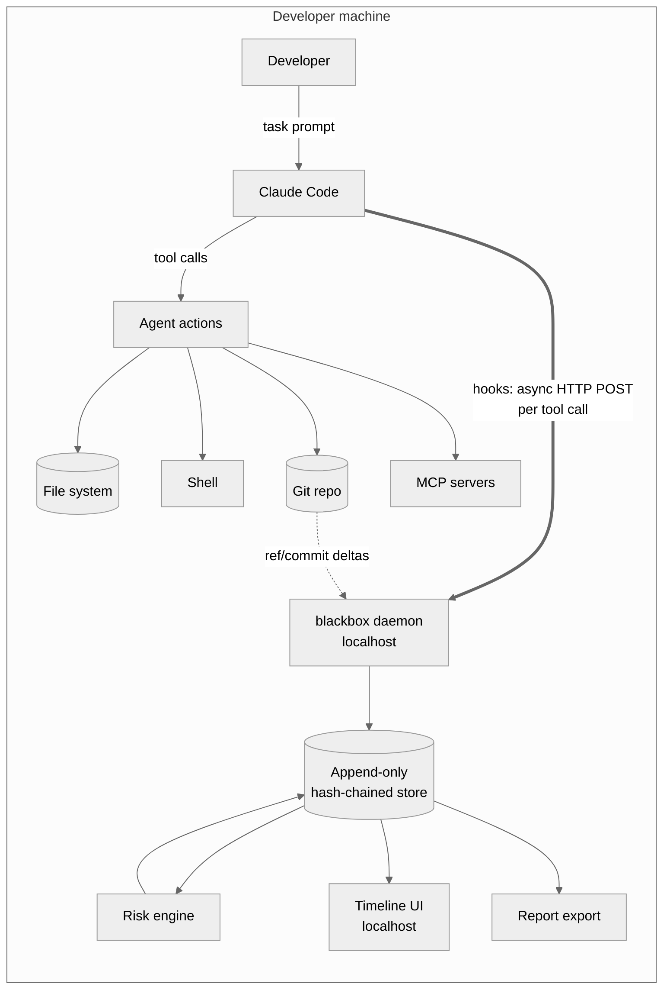
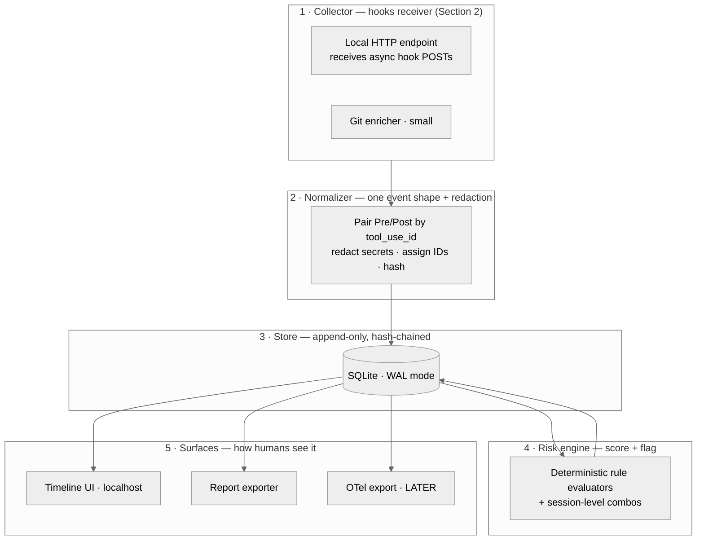
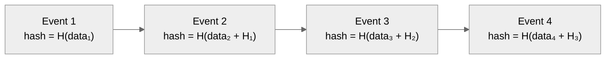
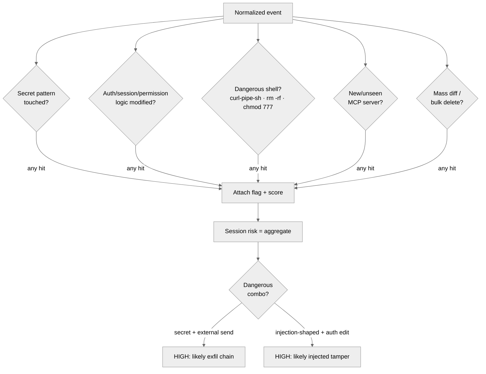
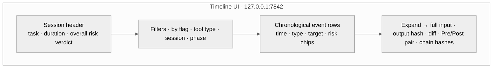
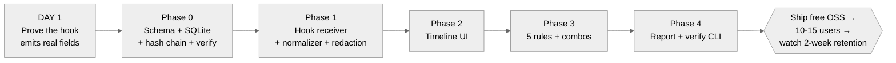
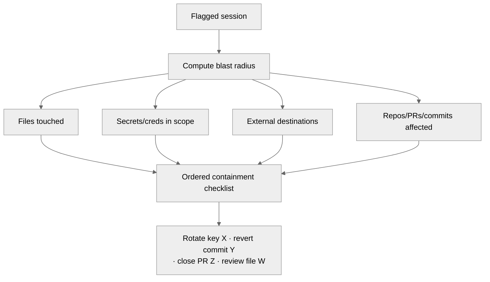
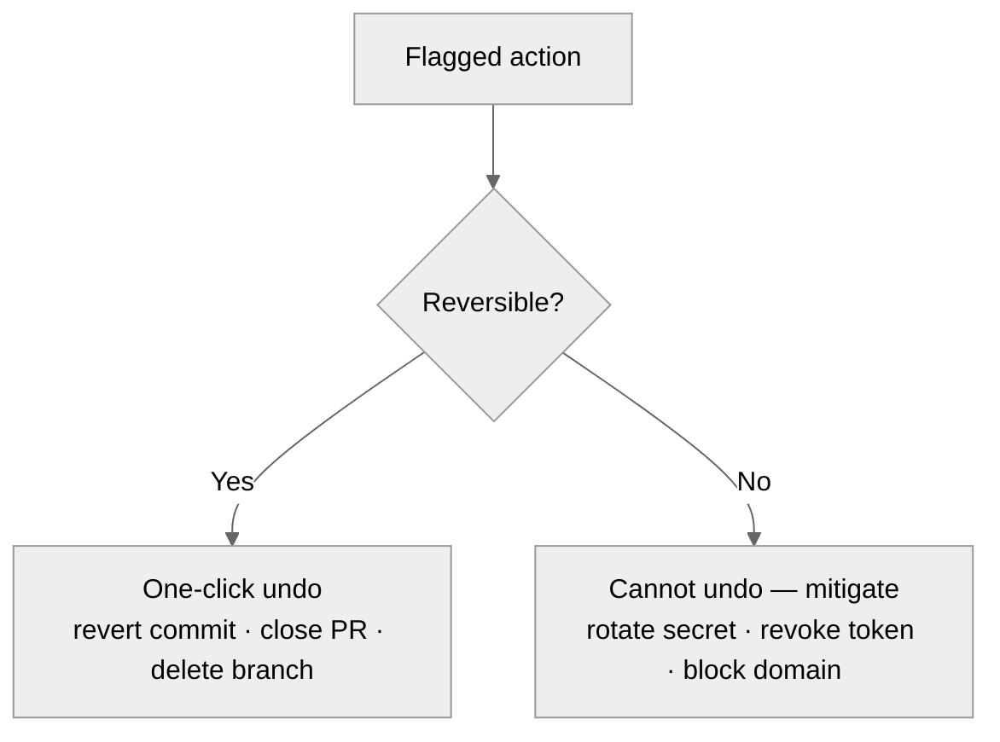

# Architecture — Agent Black-Box Recorder (working name: `blackbox-mcp`)

A forensic recorder and incident-response layer for AI coding agents (Claude Code first) and MCP tools. This is the build plan: the pieces, how they fit, what to build in what order, and the reasoning behind each choice.

> **Scope discipline.** V1 is *record + flag* — read-only, local-first, zero-config. Incident response and rollback are later rungs, marked **[LATER]** throughout. Building the whole ladder at once is the single most likely way this fails. The entire V1 exists to answer one question with real users: *does anyone keep this installed after two weeks?* Everything below serves that test.

> **Technical grounding.** The collector design in this version is built on the **actually-verified** Claude Code hooks interface (checked against the current hooks reference, mid-2026), not assumptions. Where the platform gives you something for free, this doc uses it instead of rebuilding it. Where a claim is still unverified, it's marked **⚠ VERIFY**.
>
> **Update 2026-07-11:** the Day-1 verification test (Section 2.3) has been executed for real on Claude Code 2.1.206 — see `DAY1-FINDINGS.md`. All load-bearing claims confirmed; two payload field-name discrepancies noted there.

---

## 0. The one-paragraph mental model

An AI coding agent runs a session. During that session it takes **actions** — reads/writes files, runs shell commands, calls MCP tools, makes git changes. The recorder sits *beside* the agent, **captures every action as a structured event**, **stores those events tamper-evidently**, **scores each event for risk**, and **renders the session as a reviewable timeline** with a one-command report. That's the whole product. IR and rollback are just interpretation layers on top of that same event stream.

**The one sentence that sells it:** *"When your AI agent does something risky, know exactly what it touched — every file, every command, every MCP call — in five minutes, not five hours."*

---

## 1. Where the product sits

The recorder is a **passive observer**, never in the request path. It never blocks, never adds meaningful latency, never touches the model. It listens to the agent's own event surface (Claude Code hooks) and correlates the local side effects (file changes, git refs, MCP call metadata) those hooks describe.



The thick arrow is the key insight from verifying the hooks interface: **Claude Code will POST every tool call to your local daemon by itself**, via an HTTP hook, with `async: true` so it never blocks the agent. You are not scraping, wrapping, or intercepting — the platform hands you the events. That's what makes this both safe to install (it structurally *cannot* break the agent) and trustworthy (read-only by construction).

---

## 2. The collector — how events actually get in (the make-or-break part)

**This is the highest-risk component, so it's now Section 2 instead of buried.** Everything downstream is easy; this is the part where "just prompt Fable to build it" meets reality. The good news, confirmed against the current hooks reference: the interface is richer than expected and this is very buildable. Read this section before writing any code.

### 2.1 The mechanism: HTTP hooks + async

Claude Code hooks can be configured as HTTP endpoints. You register your daemon once in `~/.claude/settings.json`:

```json
{
  "hooks": {
    "PostToolUse": [
      {
        "matcher": "*",
        "hooks": [
          { "type": "http", "url": "http://localhost:7842/hook", "async": true, "timeout": 5 }
        ]
      }
    ],
    "PreToolUse":       [ { "matcher": "*", "hooks": [ { "type": "http", "url": "http://localhost:7842/hook", "async": true, "timeout": 5 } ] } ],
    "PostToolUseFailure":[ { "matcher": "*", "hooks": [ { "type": "http", "url": "http://localhost:7842/hook", "async": true, "timeout": 5 } ] } ],
    "SessionStart":     [ { "hooks": [ { "type": "http", "url": "http://localhost:7842/hook", "async": true, "timeout": 5 } ] } ],
    "Stop":             [ { "hooks": [ { "type": "http", "url": "http://localhost:7842/hook", "async": true, "timeout": 5 } ] } ]
  }
}
```

- `matcher: "*"` on the tool events catches **every** tool, including MCP tools (which appear as `mcp__<server>__<tool>` and match the wildcard).
- `async: true` (an Anthropic-added flag) means the hook runs in the background and **never adds latency to the agent** — this directly kills the "monitoring tools slow me down, I'll uninstall it" failure mode.
- Your install command writes this block automatically (merging, not clobbering existing hooks). One command, zero manual config — that's the adoption bar.

### 2.2 What each event actually gives you (verified)

| Hook event | Fires when | Key fields you get | What you extract |
|---|---|---|---|
| `SessionStart` | Session begins/resumes | `session_id`, `cwd`, `transcript_path` | Open a session record; anchor everything to `session_id` |
| `PreToolUse` | Before a tool runs | `session_id`, `tool_name`, `tool_input`, `cwd`, `permission_mode` | The *intent*: what the agent is about to do, with full arguments |
| `PostToolUse` | After a tool succeeds | above **+ `tool_response`, `tool_use_id`, `duration_ms`** | The *result*: output, success, timing. Pair with the Pre event via `tool_use_id` |
| `PostToolUseFailure` | Tool errors/fails | `tool_name`, `tool_input`, `error`, `duration_ms` | Failed attempts — often the *most* security-relevant (blocked exfil, denied read) |
| `Stop` | Agent finishes reply | `session_id` | Close the session; trigger session-level risk aggregation + optional report |

Field notes that matter for the build:
- **`tool_input` is the whole payload.** For `Bash` it's `{command, description}`. For `Write`/`Edit` it's `{file_path, content}`. For MCP tools it's the full argument object. This is why you don't need a separate shell wrapper or filesystem watcher for the *record* — the hook already carries the command string and the file path. **This corrects the earlier design**, which over-specified independent collectors the platform makes redundant.
- **`tool_response` on `PostToolUse` gives you the output** to hash (and optionally, opt-in, to store).
- **`tool_use_id` is your join key** between the Pre (intent) and Post (result) events for the same action.
- **`transcript_path`** points at the full session JSONL — a reconstruction goldmine you can read on demand for the timeline's "what was the agent thinking" context, without storing it yourself.
- **Subagent actions fire hooks too**, carrying `agent_id`/`agent_type` — so an agent spawning a subagent to do something risky doesn't slip past you.

### 2.3 The one thing you MUST prototype first (day 1, before anything else)

Register a single `PostToolUse` HTTP hook that dumps raw event JSON to a file, then run **one real Claude Code session that (a) runs a bash command, (b) edits a file, and (c) calls an MCP tool.** Confirm with your own eyes that you receive, for all three: the tool name, the full `tool_input`, the `tool_response`, and a stable `session_id`.

If any field you're counting on is missing or shaped differently than the reference implies (**⚠ VERIFY** — docs and reality occasionally drift, and MCP `tool_response` in particular is passed through without schema validation), you want to know on **day one**, not after building the store, UI, and rules on top of an assumption. This single test collapses ~80% of the project's technical risk. Do it first.

> **✅ DONE 2026-07-11** — see `DAY1-FINDINGS.md` and `experiments/day1-hooks/`.

### 2.4 What still needs a real collector (not covered by hooks)

- **Git deltas** — hooks tell you a `git commit` bash command ran; a tiny git watcher (or just `git` calls triggered on commit-shaped commands) enriches it with the actual commit SHA, branch, and diffstat. Small, worth it.
- **Remote/HTTP MCP servers** — hooks capture the *call* your local Claude Code makes regardless of transport, so you're actually fine here for the record. True network-level egress inspection (what a remote server then does) is proxy territory → **[LATER]**.

> **Reconciliation note (what actually shipped).** This section predates the built collector layer; the current reality:
> - **Git deltas shipped as a `reference-transaction` hook** (`git-collector.ts` + `watch.ts`), not a poller — every ref update with old→new SHA, correlated to the session. Ground-truth *file* changes are captured at SessionEnd by **R2 reconciliation** (`worktree.ts`/`reconcile.ts`), diffing the worktree against the session-start git anchor.
> - **The `lsof`/`nettop`/ppid network+process poller was cut**: prototyped in `experiments/four-collectors-demo/`, never shipped in `src/`. A ~1s poll can't attribute a sub-second exfil, so it would produce false alarms in exactly the case the tool must be believed. Network/process visibility is a deferred opt-in **Tier-2** capability (`docs/FORENSIC-COLLECTORS.md`).
> - **Field-name drift** (docs say `tool_output`/`tool_error`; live payloads use `tool_response`/`error`) is handled by storing the verbatim payload in `raw` and deriving normalized columns with a tolerant parser (`normalize.ts`) — see `docs/DAY1-FINDINGS.md`.

---

## 3. Component breakdown



**Design rule for collectors:** each is dumb and independent. If the git enricher throws, the hook receiver still records. Never let an enrichment failure drop the primary event.

---

## 4. The event schema

The heart of the system — everything reads and writes this. Get it right early; migrating it later is the most painful change you can make.

```json
{
  "event_id": "evt_01J8...",
  "session_id": "ses_abc123",
  "tool_use_id": "toolu_01ABC...",
  "sequence": 42,
  "prev_hash": "sha256:abc...",
  "hash": "sha256:def...",
  "timestamp": "2026-07-01T14:32:01.412Z",
  "duration_ms": 128,

  "agent": {
    "name": "claude-code",
    "version": "x.y.z",
    "agent_id": null,
    "agent_type": "main",
    "cwd": "/Users/dev/myproject",
    "permission_mode": "default",
    "task_summary": "fix session-expiry bug in auth middleware"
  },

  "action": {
    "phase": "pre | post | failure",
    "type": "mcp_call | shell_command | file_read | file_write | file_edit | git_action | web_fetch | other",
    "tool_name": "mcp__github__get_issue",
    "target": { "path_or_url": "src/auth/session.ts", "repo": "myorg/myapp" },
    "input_redacted": { "issue_number": 402 },
    "output_hash": "sha256:...",
    "output_size_bytes": 2048,
    "success": true,
    "error": null,
    "diff_summary": { "files_changed": 1, "insertions": 4, "deletions": 12 }
  },

  "risk": { "score": 0, "flags": [], "ruleset_version": "r1" },

  "provenance": {
    "mcp_server": "github",
    "mcp_server_transport": "stdio | http",
    "first_seen_this_server": false,
    "transcript_path": "/Users/dev/.claude/projects/.../session.jsonl"
  },

  "approval": { "required": false, "status": "auto", "approver": null }
}
```

**What changed from the naive version, and why:**
- **`tool_use_id`** promoted to top level — it's the real join key the platform gives you between intent (Pre) and result (Post). Store both phases; don't collapse them, because the *gap* between "agent tried X" and "X returned Y" is where interesting security stories live.
- **`action.phase`** distinguishes `pre`/`post`/`failure`. **Failures are first-class** — a *blocked* `.env` read or a *failed* exfil attempt is often higher-signal than a success, and the earlier design silently dropped these.
- **`output_hash` not output body, by default.** You can prove "this is what the agent saw" without hoarding sensitive data. Raw capture is strictly opt-in.
- **`agent_id`/`agent_type`** so subagent actions are attributable, not anonymous.
- **`approval`** is dormant in V1 (everything `auto`) but present so the **[LATER]** policy layer needs no migration.

---

## 5. Storage & tamper-evidence

### Append-only + hash-chained
Your audience is security engineers. Their first question about any log is "can it be altered after the fact?" Answer it in the *design*, not a FAQ.



Each event's hash includes the previous event's hash. Alter or delete any event and every hash after it fails to verify. A `blackbox verify` command that walks the chain and reports the first break is ~20 lines and a genuinely great demo moment.

**Honest limit (state this in your README — it builds credibility rather than undermining it):** a local hash chain proves *internal consistency and tamper-evidence*, not *tamper-proofing*. Someone with write access to the machine can recompute the whole chain from a chosen point. The chain detects casual/partial edits and accidental corruption, and gives you a verifiable artifact. **Real** tamper-*resistance* requires anchoring — periodically signing the head hash with a key the local user doesn't hold, or shipping heads to an append-only remote. That anchoring is exactly a paid/enterprise feature → **[LATER]**. Don't overclaim the local version; security people will catch it and it'll cost you trust.

### Store choice: SQLite (WAL mode)
The earlier "JSONL or SQLite" hedge was a wobble. **Just use SQLite from the start.** It's a single local file (keeps the "local-first" promise), needs no server, and gives you the indexed queries the timeline UI's filters need. WAL mode handles concurrent writes from async hooks landing while the UI reads. JSONL saves you nothing meaningful and you'd migrate off it within a week. Keep the hash chain in a column.

### Privacy posture (non-negotiable — this IS the adoption lever)
- Local-first. Nothing leaves the machine by default.
- **Redact at capture, not at display.** A secret must never be written to disk in the clear by a tool that markets itself as *security* software — that's a worse failure for you than for a normal app. Redaction gets its own hardening pass (Section 6), not one bullet.
- Store output hashes, not bodies, unless the user opts in per-session.
- The daemon binds to `127.0.0.1` only. Never `0.0.0.0`.

---

## 6. Secret redaction (its own section, because getting this wrong is fatal)

The earlier draft treated "redact secrets at capture" as a single line. It's a real subsystem and the one place a bug turns your security tool into a *liability*. Design:

- **Layered detection, not one regex:** (1) known-prefix tokens (`sk-`, `ghp_`, `AKIA`, `xoxb-`, JWTs, PEM blocks), (2) high-entropy string detection (Shannon entropy over a length threshold) for unknown formats, (3) path-based rules (anything read from `.env`, `*.pem`, `.aws/credentials` gets its *content* dropped to a hash regardless).
- **Redact on the way IN to the store**, in the normalizer, before the first write. Never "store then scrub."
- **Fail closed:** if redaction throws on a field, drop that field to a hash rather than storing it raw. An over-redacted event is a bug report; an under-redacted one is a breach.
- **Ship a `--audit-redaction` mode** that shows the user exactly what got redacted (as `[REDACTED:token]` placeholders) so they can trust it and tune it. Trust through transparency.
- Reuse a proven library (detect-secrets, gitleaks rulesets) for the pattern corpus rather than hand-rolling — this is a place to stand on existing work, and you already know these tools.

---

## 7. Risk engine

Deterministic, versioned rules. **Start with 5 high-precision rules, not 50 noisy ones** — a false-positive-happy tool gets uninstalled the first day. Precision protects retention; retention is the only metric that matters.



**The 5 starter rules:**
1. **Secret touch** — path or content matches the redaction corpus (`.env`, keys, high-entropy strings, known prefixes).
2. **Auth-logic modification** — writes to auth/session/permission code. *This is your differentiator — but be honest about the two tiers of it (below).*
3. **Dangerous shell** — `curl … | sh`, `rm -rf`, `chmod 777`, base64-decode-then-exec, piping remote content to an interpreter. Parse from `tool_input.command` on `Bash` events.
4. **New MCP server** — `first_seen_this_server == true` mid-session → the tool-poisoning / rug-pull signal.
5. **Mass/oversized diff** — abnormally large change or bulk deletion (accidental destruction *and* exfil-staging).

**Be honest about the "auth differentiator" — I oversold it last time.** Two tiers:
- **Tier 1 (easy, ship in V1):** detect that a *file in an auth-shaped path* changed. Generic, cheap, still useful. Don't call this a moat — it's table stakes dressed up.
- **Tier 2 (hard, the actual edge):** detect that a change *weakened a security property* — removed a check, widened a scope, flipped a comparison, loosened a token expiry, disabled a guard. This is semantic diff analysis, materially harder, and it's where your deep domain knowledge becomes a real, hard-to-copy asset. **Ship Tier 1 in V1; make Tier 2 your differentiation roadmap.** Conflating them (as the prior draft did) would have you claiming a moat you hadn't built.

**Combination logic is the highest-value part.** Single flags are often benign. The signal is the *chain*: secret-touch **then** external network send in one session = exfil pattern; injection-shaped tool output **then** auth edit = injected tamper. Fire the session-level HIGH on combos, not individual flags. Version every ruleset (`ruleset_version`) so a report is reproducible — "flagged under ruleset r3" is what makes output audit-credible.

---

## 8. Timeline UI

One page, served on `127.0.0.1`. Reads from SQLite. Plain HTML + a little JS to start; reach for a framework only if interactions demand it.



Each row = one action: timestamp, type, target, risk chips. Expand for the full `tool_input`, the paired Pre/Post, the diff, and the hash pair (so a skeptic can eyeball the chain). **The output screen IS the marketing** — design the flagged-session view to be clean enough that people screenshot it and post "look what my agent tried." That screenshot is worth more reach than any ad. That's the whole V1 UI.

---

## 9. Report export

One command → a one-page Markdown report (PDF later, only if a design partner needs something for an auditor):
- Session ID, agent + version, task, start/end, duration
- Overall risk verdict + `ruleset_version`
- Each flagged action: type, target, timestamp, why it flagged, Pre/Post pair
- A plain-language **"what to check"** list — the seed of incident response (Section 11)

Markdown first: it's what devs paste into Slack and tickets, and it's trivial to generate.

---

## 10. Build sequence



- **DAY 1 — De-risk.** The Section 2.3 test. Prove the hook delivers the fields before building anything on them. Non-negotiable, and it's the change that most improves this plan over the last version. **✅ DONE — see `DAY1-FINDINGS.md`.**
- **Phase 0 — Foundation.** Event schema, SQLite store, hash chain, `verify`. No observation yet — just prove you can write and verify a chain.
- **Phase 1 — Collector + redaction.** Hook receiver → normalizer (Pre/Post pairing by `tool_use_id`) → redaction → store. Now real sessions produce real, safe logs. Dogfood on your own vuln-research pipeline — you're user zero.
- **Phase 2 — Timeline UI.** Render sessions. First moment it feels real.
- **Phase 3 — Risk engine.** 5 rules + combination highlighting.
- **Phase 4 — Report + verify CLI.** Now it's demoable and shippable.
- **Then ship, get 10–15 people, watch retention.** That number decides everything after.

**Realistic timeline for you (student + internship):** 3–6 weeks calendar, ~40–70 focused hours. The variance is almost entirely Phase 1 (redaction hardening + any hook surprises from Day 1). The store, UI, and rules are fast.

### Deliberately NOT in V1 — the discipline list
- MCP **proxy** mode (remote egress inspection) — only when a user hits the gap.
- **Policy enforcement / blocking** — you're a recorder, not a gatekeeper, until trusted. (Note: the hooks *can* block via exit-2 / `permissionDecision` — resist using it in V1. Blocking creates the "it broke my agent" uninstall risk you're specifically avoiding.)
- **IR automation** — Section 11.
- **Rollback / containment** — Section 12; needs write access = big trust jump.
- **Remote hash anchoring** — the real tamper-*proofing*; a paid feature.
- **Multi-agent** (Cursor, Copilot) — prove Claude Code + MCP first. *(Cursor/Copilot don't expose an equivalent clean hook surface, so this is genuinely harder, not just deferred — factor that into any "expand later" promises.)*
- Hosted dashboard, SSO, SIEM connectors, enterprise anything.

---

## 11. [LATER] Incident Response (v1.5)

Interpretation on top of the recording — needs Phases 0–4 shipped and trusted first.



The events already hold the blast-radius inputs. IR just walks the session and orders them into "check this, in this order." This is where a paid tier first makes sense — *if* retention says people want it.

---

## 12. [LATER] Rollback / containment (v2)

The flashy one, correctly last. Core honesty: **actions split into reversible and irreversible.**



"Undo a commit" is real. "Undo a secret that already left the machine" is not — the honest operation is *rotate/revoke*, a different action. So "Ctrl-Z for AI" is really *one-click undo for reversible actions + a guided mitigation checklist for irreversible ones.* This also needs **write/destructive access** to repos and infra — a trust level earned only after the read-only recorder proves itself. Never lead with this.

---

## 13. Threat coverage — honest capability map

| Threat | Recorder detects? | Prevents? | Notes |
|---|---|---|---|
| Prompt injection via tool output | After the fact | No | You're not in the request path by design; you catch the *consequence* |
| MCP tool/schema poisoning | Yes (new-server + behavior) | No | `first_seen_this_server` is the cheap tell |
| Secret / source exfiltration | Yes — strongest case | No | Secret-touch → external-send combo |
| Dangerous shell commands | Yes | No | Parsed from `tool_input.command` |
| Auth-logic modification | Tier 1 yes / Tier 2 roadmap | No | Path-touch is easy; *weakening* detection is the real edge |
| Failed/blocked malicious attempts | Yes | No | Via `PostToolUseFailure` — often the highest-signal events |
| Log tampering | Detects locally | Partial | Hash chain detects; true resistance needs remote anchoring [LATER] |
| Dependency supply-chain | Partial | No | Flags new installs; doesn't vet packages |
| Overbroad permissions | No | No | That's identity's job (Okta/Astrix), not yours — don't pretend otherwise |

Stating the "No" column plainly is part of the trust story. "I detect, I don't prevent, here's exactly what I can't see" reads as more credible than overclaiming — and credibility is the whole game with this audience.

---

## 14. Tech stack

- **Language:** TypeScript/Node. It pairs naturally with Claude Code's ecosystem, makes the localhost HTTP receiver + UI trivial in one runtime, and is what the hook examples assume. (Python is viable and matches your existing tooling, but you'd split runtimes for the UI.) Pick TS unless you'll ship materially faster in Python.
- **HTTP receiver:** anything minimal (Fastify/Express/Hono). It only needs one POST route.
- **Store:** SQLite in WAL mode. `better-sqlite3` (Node) is synchronous and dead simple.
- **Redaction:** wrap an existing secret-pattern corpus (detect-secrets/gitleaks rules) + an entropy check.
- **Hashing:** SHA-256 from the stdlib. No crypto dependencies.
- **UI:** static HTML/JS served by the same daemon; add a framework only if needed.
- **Packaging:** single `npm i -g blackbox-mcp` (or `npx`), an `init` command that writes the hook config into `~/.claude/settings.json` idempotently, zero further config.
- **[LATER] export:** OpenTelemetry-compatible event export so it slots into existing SIEM pipelines instead of fighting them.

---

## 15. What makes this spread (built into the architecture, not bolted on)

- **The flagged-session screenshot** is the growth engine — design it to be postable. "My agent got prompt-injected and tried to exfil my `.env`; here's the timeline" is a story people share.
- **The scary-finding writeup** is the launch: run this against real MCP servers, find a genuine exfil/injection pattern, publish *that* (r/netsec, Show HN, HN). The tool is what let you find the story. This is the General-Analysis playbook — and you out-*narrow* them by going all-in on Claude Code + MCP.
- **`blackbox verify`** is the demo money-shot: tamper with a log, run verify, watch it pinpoint the break.
- **Zero-config install** is a growth feature: one command, hook auto-registers, next session just appears in the timeline. Every step of friction removed is retention protected.

---

## Appendix — decision log (why these choices)

- **Passive async HTTP hook, not proxy/wrapper:** structurally can't break the agent, adds no latency (`async: true`), trivial to install, and the platform hands you the events. Verified against the current hooks interface, not assumed.
- **Day-1 hook-reality test:** the single biggest risk is "the events don't carry what I think" — so prove it before building on it. This is the top change from the prior draft.
- **SQLite from the start:** the JSONL hedge saved nothing and cost a migration. Decide once.
- **Redaction as a real subsystem, fail-closed:** an under-redacted event is a breach in a *security* tool. This earns the paranoid-user trust that drives adoption.
- **Auth detection split Tier 1 / Tier 2:** honesty about where the actual moat is (semantic weakening detection) vs. table stakes (path touch). Don't claim the moat until it's built.
- **Failures are first-class events:** blocked/failed malicious attempts are often the highest-signal, and the naive design dropped them.
- **Hash chain ≠ tamper-proof:** claim tamper-*evidence* locally, reserve tamper-*resistance* (remote anchoring) for [LATER]/paid. Overclaiming here specifically loses the security audience.
- **Record → IR → rollback as separate rungs:** each needs the trust and data of the one below. Bundling them is the "become a worse-funded Zenity" trap.
- **Retention is the only V1 metric:** not stars, not installs — people still opening the timeline at two weeks. Every architectural choice above serves that.
