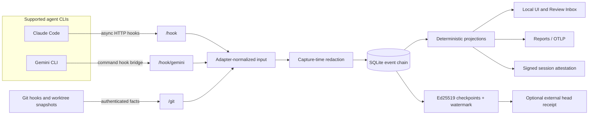

# Blackbox architecture

This document describes the implemented `0.1.x` architecture. Files named `PHASE*.md`, `FORENSIC-ROADMAP.md`, and the experiment notes preserve historical design decisions; they are not the current capability contract. When those documents disagree with this one or the CLI help, use this document and the code.

## Product boundary

Blackbox is a passive, local-first forensic recorder and review layer for AI coding agents. It currently has first-party adapters for Claude Code and Gemini CLI. It observes hook-visible activity, stores redacted evidence in one tamper-evident chain, derives deterministic findings, and exposes a local investigation and pre-merge review workflow.

It is not in the model request path and does not block tools, enforce policy, sandbox a process, restore files, or claim kernel-level attribution.

The architecture is governed by six invariants:

1. redact before the first evidence write;
2. never mutate an existing event row;
3. preserve old chain bytes during additive migrations;
4. keep interpretations and human review state outside the evidence chain;
5. treat all recorded strings as hostile at the UI boundary;
6. keep raw evidence local unless a user explicitly chooses an export surface.

## System overview


```mermaid
flowchart LR
    subgraph Agents["Supported agent CLIs"]
        C["Claude Code"]
        G["Gemini CLI"]
    end

    C -->|"async HTTP hooks"| HC["/hook"]
    G -->|"command hook bridge"| HG["/hook/gemini"]
    GR["Git hooks and worktree snapshots"] -->|"authenticated facts"| GI["/git"]

    HC --> N["Adapter-normalized input"]
    HG --> N
    GI --> N
    N --> R["Capture-time redaction"]
    R --> S[("SQLite event chain")]

    S --> P["Deterministic projections"]
    P --> UI["Local UI and Review Inbox"]
    P --> RP["Reports / OTLP"]
    P --> AT["Signed session attestation"]

    S --> CP["Ed25519 checkpoints + watermark"]
    CP --> AR["Optional external head receipt"]
```

The daemon binds to `127.0.0.1` and is the normal single writer. SQLite WAL allows the UI and CLI to read while hooks are being appended.

## Capture adapters

### Claude Code

`src/init.ts` atomically merges Blackbox HTTP handlers into `~/.claude/settings.json` without replacing unrelated hooks. Existing settings must be a JSON object; every changed version gets a private, no-clobber backup before replacement. Lifecycle, prompt, pre-tool, post-tool, tool-failure, compaction, notification, stop, and session-end events are posted to `/hook`. Tool hooks are configured as asynchronous so recording does not sit on Claude's critical path.

Claude supplies `tool_use_id`, which joins pre-tool intent to the reported success/failure event. The transcript reader can add prompt and agent-stated reasoning projections when Claude's local transcript format is available; parse failures degrade to missing metadata rather than aborting capture.

### Gemini CLI

`src/gemini-init.ts` atomically merges named command hooks into `~/.gemini/settings.json`, preserving unrelated settings and writing a private backup before changing an existing file. The hook command uses absolute paths to the durable Node runtime and installed Blackbox CLI.

The adapter in `src/adapters/gemini.ts` maps Gemini's documented events into the shared normalizer contract:

| Gemini event | Normalized hook event |
| --- | --- |
| `SessionStart` | `SessionStart` |
| `BeforeAgent` | `UserPromptSubmit` |
| `BeforeTool` | `PreToolUse` |
| `AfterTool` | `PostToolUse` or `PostToolUseFailure` |
| `AfterAgent` | `Stop` |
| `Notification` | `Notification` |
| `PreCompress` | `PreCompact` |
| `SessionEnd` | `SessionEnd` |

Gemini does not provide Blackbox's established tool-use join key. A bounded in-memory correlator creates an id at `BeforeTool` and resolves `AfterTool` FIFO by session, mapped tool name, and canonical redacted input. Restart, expiry, or ambiguity degrades to an unmatched post event; it never fabricates a join.

The internal `blackbox hook gemini` bridge reads bounded stdin, attempts a bounded loopback post, prints exactly Gemini's allow response, and exits zero on all recorder/input errors. Recorder failure therefore cannot deny the tool call. Command-hook process startup can still add more overhead than Claude's asynchronous HTTP callback.

### Git facts

`src/watch.ts` installs repository or global Git hooks. `/git` requires a generated collector token unless the daemon is deliberately started with `--allow-insecure-git`. `src/git-collector.ts` validates object ids before invoking Git, classifies ref changes, and correlates them to a session when the available evidence supports that attribution.

At session boundaries, `src/worktree.ts` captures a Git anchor, dirty-worktree baseline, and end-state delta when the working directory is a repository. Reconciliation can therefore distinguish pre-existing work from changes observed during the session.

## Normalized event schema

`src/types.ts` is the single event contract. Each row contains:

- global sequence, event id, session id, prompt id, and optional tool-use id;
- normalized phase, hook event, action type, tool name, and human-facing target;
- agent and source metadata;
- working directory and permission mode when supplied;
- tool-reported success and duration;
- event and capture timestamps;
- a redacted raw payload, output commitment/size, redaction count, and structured detail;
- previous hash and row hash.

`source` is `claude-code`, `gemini-cli`, `git`, or `blackbox` on new adapter/internal rows. It is nullable so stores created before source attribution can be opened without rewriting any old event.

Normalization is deliberately tolerant. A vendor field rename can reduce a normalized projection to `null`, but does not justify inventing a value or rejecting an otherwise recordable event. Oversized hooks become bounded marker events. Malformed or unsupported payloads are logged and dropped without crashing the daemon.

## Redaction and mutation evidence

`src/redact.ts` runs before `Store.append`. It covers known credential prefixes, credential-bearing assignments and headers, sensitive file operations, and conservative entropy patterns. If redaction fails, output/body content is replaced by a hash rather than persisted unsanitized.

Tool output bodies are elided by default. The chain stores a SHA-256 commitment and byte length. `--capture-output` retains a redacted body, not an unfiltered body.

File writes and edits are split into:

- a mutation fact in the hashed event detail (content hash, size, encoding, and diff metadata); and
- optional redacted content in the `blobs` table keyed by that content hash.

`blackbox prune` can replace old blob content with a tombstone while preserving the commitment and event bytes. Chain verification is unchanged by pruning.

## Evidence chain and migrations

The immutable spine is `events` plus `chain_meta`:

1. `Store.append` assigns the next global sequence.
2. `prev_hash` is the prior row hash or the genesis constant.
3. `hashEvent` hashes the canonical normalized columns plus `prev_hash`.
4. the event and new chain head are committed in one immediate transaction.

`blackbox verify` streams the chain, recomputes hashes, validates links/sequences, and compares the final row to `chain_meta`. With a trusted public key and watermark, it also checks local Ed25519 checkpoint integrity and rollback expectations. `--anchors` compares configured external receipts.

The current hash/schema format is version `1`. Store opening follows two compatibility rules:

- a database stamped with a newer schema version is refused before migration;
- missing known event columns are added as nullable columns.

Canonical hashing omits null-valued keys. The additive `source` migration therefore leaves legacy row hashes byte-compatible: old rows read `source = null`, while new rows commit to a source value. Review tables and other projections are also created additively and do not modify event bytes.

## Hashed, committed, and derived state

Not every local table has the same trust semantics.

| State | Relationship to evidence | Mutability |
| --- | --- | --- |
| `events`, `chain_meta` | The append-only hash chain | Existing rows must never change |
| mutation facts in event `detail` | Hash-committed | Immutable with the event |
| `blobs` | Content-addressed by an event commitment | Bytes may be pruned; tombstone remains |
| `risk`, `session_risk` | Deterministic projection of events | Recomputable/versioned |
| `session_reconciliation`, `session_intent` | Deterministic evidence comparisons | Recomputable/versioned |
| `search_idx`, `search_meta` | Search projection | Rebuildable |
| `signatures`, `session_identity` | Signed commitments derived from chain state | Regenerable under the local key |
| `review_actions` | Human decisions bound to an evidence/policy snapshot | Append-only local ledger, not re-derivable |
| project `.blackbox/policy.json` | Reviewer-authored presentation policy | External to the store; normalized and hashed when used |

Rescoring, reconciliation, indexing, pruning, review decisions, UI reads, and attestation generation must leave `verify()` byte-identical.

## Findings and outcomes

`src/risk-rules.ts` contains frozen/versioned rule definitions; `r4` is current. `src/risk-engine.ts` evaluates individual events and session-level combinations. `src/findings.ts` projects those rule fires into evidence-linked findings.

Outcome is derived from tool lifecycle evidence:

- `succeeded`: a matching tool post event reported success;
- `failed`: a matching failure event reported failure;
- `attempted`: intent exists without a conclusive result;
- `unknown`: the record cannot support a stronger statement.

Outcome is carried consistently through review, explanation, graph, blast-radius, Markdown report, and OTLP projections. Severity and outcome are orthogonal. For example, a failed sensitive-data send can remain high severity while its text and graph edges say attempted/failed rather than sent/confirmed.

## Reconciliation and coverage

`src/reconcile.ts` compares hook mutation facts with the Git-observed worktree delta and dirty baseline. It reports corroborated state, ghost mutations, phantom mutations, and content mismatches. Transcript completeness, when available, compares expected tool-use records with captured events and marks explained/unexplained missing calls.

These layers improve confidence but do not turn Blackbox into a kernel sensor. Git can corroborate file state, not arbitrary processes or network delivery.

## Review Inbox and baselines

`src/review.ts` builds stable finding keys from session, ruleset, finding kind/id, and normalized evidence sequences. Session-level causal findings and individually risky actions are separate review items. Annotation-only events remain context and do not create unnecessary inbox rows.

`src/review-inbox.ts` joins current findings to the newest action for each finding. A review action contains:

- disposition and optional note;
- session head sequence/hash at review time;
- normalized baseline-policy hash at review time;
- timestamp and unique action id.

A decision resolves a finding only while both the evidence head and policy hash still match. Appending session evidence or changing policy makes it stale. Reopening appends another `unreviewed` action; existing decisions are never updated or deleted.

The browser's only write API is `POST /api/review`. It requires same-origin/Host checks and a per-daemon CSRF token. Recorded evidence is never mutated by this endpoint.

`src/baseline.ts` reads `<repo>/.blackbox/policy.json` without following symlinks and enforces a 64 KiB limit, known fields, bounded entries/patterns, and a supported version. Entries match only normalized finding metadata. A match adds an expected label and reason; it never suppresses a finding or changes severity.

An invalid baseline is a distinct fail-closed state. It invalidates prior review decisions, prevents new decisions, and prevents an attestation from signing ambiguous review state.

## Signed session attestations

`src/attest.ts` creates a standalone `blackbox-session-attestation` v1 envelope. Generation:

1. verifies the full local evidence chain, trusted recorder key, and optional watermark;
2. loads the requested session and captures its range/head;
3. recomputes the current `r4` assessment and Review Inbox projection in memory;
4. includes current reconciliation coverage when it matches the session head;
5. rechecks the session and chain inside the same SQLite read snapshot, preventing concurrent WAL writers from mixing states;
6. signs domain-separated canonical payload bytes with Ed25519.

The payload uses a closed metadata allowlist: session id, evidence range/head, optional commit/branch, recorder fingerprint, agent sources, aggregate verdict/findings/review, aggregate coverage, and issue time. Captured revision selection walks session anchors in order, so a SessionEnd anchor is preferred over the pre-work SessionStart anchor while older start-only sessions remain compatible. The payload excludes prompts, commands, paths, hosts, working directories, session names, raw events, blobs, tool output, and review notes.

Standalone verification validates the exact schema and signature under the embedded public key. Local `--check` additionally pins that key to the local recorder and verifies the chain and session range. It intentionally does not compare current derived risk/review state to a historical attestation; acknowledgements and policy can legitimately evolve after signing. Enforcement is stricter than informational verification: `--fail-on` and `--github-output` on an existing artifact require `--trusted-key` or `--check`.

`src/github-check.ts` optionally appends a metadata-only Markdown summary to `GITHUB_STEP_SUMMARY` and named values to `GITHUB_OUTPUT`. Output requires a pinned/local recorder identity and a full expected revision (`--expected-commit` or `GITHUB_SHA`) that exactly matches the signed commit. A threshold converts unresolved signed severity aggregates into pass/fail exit status; without a threshold, the result is explicitly informational. Generation in Actions requires `--out` so the full envelope is not printed into workflow logs. This uses the normal GitHub Actions job check; Blackbox does not call the Checks API, need a GitHub token, or upload the attestation file.

## Custody ladder

Each custody layer closes a narrower failure class:

1. **hash chain:** detects row edits, broken links, and sequence corruption;
2. **`chain_meta`:** detects a valid-prefix tail deletion unless metadata is also rewritten;
3. **local Ed25519 checkpoints:** detect alteration under a different key and changes at signed heads;
4. **out-of-database watermark:** detects expected-signature deletion/rollback when the watermark survives;
5. **external receipt:** witnesses a signed chain head at a destination outside the attacker's write scope.

External targets are `file:`, `git:`, or `https:`. A receipt contains chain position, head hash, timestamp, signature, and public-key identity—not prompts, code, paths, commands, tool output, or findings. A file target on the same machine is local-only custody, even though it uses the same receipt format.

No local construction can defeat an attacker who controls the database, key, watermark, configuration, and all surviving receipts. External resistance depends on the destination actually being outside that attacker's authority.

## Read API and UI

`src/read-api.ts` and the projection modules collapse low-level events into session cards, prompt-oriented activity, findings, explanations, mutation history, search, blast radius, reconciliation, and causal graph data. The daemon serves same-origin `GET /api/*` routes plus the review write route.

The UI is dependency-free browser JavaScript assembled by `src/ui-page.ts`. Recorded strings are inserted with `textContent`/DOM nodes, never interpreted as HTML. A restrictive CSP, loopback Host validation, same-origin checks, and anti-DNS-rebinding checks protect the local read surface.

First-run readiness is derived from runtime, configuration, key, adapter-hook, daemon, custody, chain, and self-test checks. The UI exposes direct routes for the Review Inbox (`#/review`) and Health & Privacy (`#/settings`).

## Privacy and explicit egress

The default store, keys, logs, review notes, raw redacted payloads, and mutation evidence stay under `~/.blackbox`. New configuration/key/database files are tightened to private POSIX modes where supported.

Explicit or configured output surfaces are:

- external anchor receipts (`git:` auto-push, `https:`, or a user-selected file destination);
- `blackbox otel --endpoint`, which posts a redacted OTLP projection;
- `blackbox attest --github-output`, which writes aggregate values to GitHub Actions-managed files;
- local report, OTLP, and attestation files that another user-controlled tool may later upload.

Anchoring is not raw-evidence egress. OTLP is richer operational metadata and must be reviewed as an export. Actions output is aggregate metadata, but GitHub can retain it with the workflow run.

## Startup and failure behavior

`blackbox install` persists the exact running npm package before setup so long-lived configuration never references an `npx` cache. `blackbox init` decides custody, starts the daemon, confirms `/health`, and runs the isolated self-test before installing agent hooks. If adapter installation fails, completed adapter changes are rolled back from private backups where possible.

The recorder intentionally fails open for the agent and fail closed for evidence claims:

- hook transport/parse failure does not block the agent;
- missing correlation remains unmatched;
- missing coverage remains unavailable;
- invalid configuration/key/policy is surfaced rather than silently broadened;
- chain failure prevents attestation generation;
- a newer store schema is refused rather than rewritten by an older binary.

## Source map

```text
src/
├── adapters/                     vendor hook → normalized input adapters
├── init.ts · gemini-init.ts      non-destructive adapter setup/removal
├── daemon.ts                     loopback ingestion, read/review API, UI server
├── normalize.ts · redact.ts      canonical event projection and pre-write scrub
├── types.ts · store.ts · hash.ts event contract, SQLite chain, migrations
├── risk-rules.ts · risk-engine.ts · findings.ts
│                                 versioned rules, causal combinations, outcomes
├── baseline.ts · review.ts · review-inbox.ts
│                                 strict expectations and human review projection
├── mutation.ts · filestate.ts    committed mutation facts and prunable bodies
├── worktree.ts · reconcile.ts    Git corroboration and coverage
├── sign.ts · anchor.ts           checkpoints, watermark, external receipts
├── attest.ts · github-check.ts   signed aggregates and Actions integration
├── report.ts · otel.ts           explicit export formats
├── readiness.ts · doctor.ts      onboarding and recorder health
└── ui/                            hostile-data-safe local interface
```

The automated suite covers pure rules and redaction, legacy-store migrations, review/baseline staleness, adapter normalization/settings merge, chain and attestation integrity, daemon integration, UI invariants, and packed install lifecycle. CI runs supported Node lines (`22`, `24`, `26`) on macOS and Linux.
